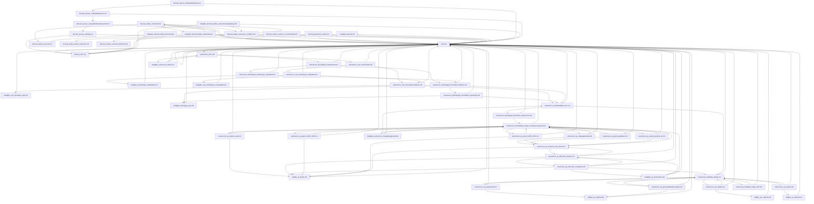

# Advisor Logic Diagram

This diagram shows the flow of the Veteran's Preference Advisor.

```mermaid
graph TD;
  ineligible_general["ineligible_general.md"];
  start["start.md"];
  ineligible_general --> start;
  ownservice_tp_wartime_wwii["ownservice_tp_wartime_wwii.md"];
  eligible_tp_5point["eligible_tp_5point.md"];
  ownservice_tp_wartime_wwii --> eligible_tp_5point;
  ownservice_nodisability_nossps_checkserviceperiod["ownservice_nodisability_nossps_checkserviceperiod.md"];
  ownservice_tp_wartime_wwii --> ownservice_nodisability_nossps_checkserviceperiod;
  ownservice_tp_wartime_wwii --> start;
  ownservice_intro["ownservice_intro.md"];
  start --> ownservice_intro;
  derived_intro["derived_intro.md"];
  start --> derived_intro;
  start --> ineligible_general;
  start --> start;
  ownservice_xp_purpleheart["ownservice_xp_purpleheart.md"];
  eligible_xp_10point["eligible_xp_10point.md"];
  ownservice_xp_purpleheart --> eligible_xp_10point;
  ownservice_disability_details["ownservice_disability_details.md"];
  ownservice_xp_purpleheart --> ownservice_disability_details;
  ownservice_xp_purpleheart --> start;
  derived_spouse_vetqualifiedforemployment["derived_spouse_vetqualifiedforemployment.md"];
  derived_spouse_vetliving["derived_spouse_vetliving.md"];
  derived_spouse_vetqualifiedforemployment --> derived_spouse_vetliving;
  derived_spouse_vetqualifiedforemployment --> start;
  derived_widow_remarried["derived_widow_remarried.md"];
  ineligible_derived_widow_remarried["ineligible_derived_widow_remarried.md"];
  derived_widow_remarried --> ineligible_derived_widow_remarried;
  derived_widow_vetservice_condition["derived_widow_vetservice_condition.md"];
  derived_widow_remarried --> derived_widow_vetservice_condition;
  derived_widow_divorced["derived_widow_divorced.md"];
  derived_widow_remarried --> derived_widow_divorced;
  derived_widow_remarried --> start;
  ownservice_tp_24month_duration["ownservice_tp_24month_duration.md"];
  ownservice_tp_24month_duration --> eligible_tp_5point;
  ownservice_tp_24month_exceptions["ownservice_tp_24month_exceptions.md"];
  ownservice_tp_24month_duration --> ownservice_tp_24month_exceptions;
  ownservice_tp_24month_rule_check["ownservice_tp_24month_rule_check.md"];
  ownservice_tp_24month_duration --> ownservice_tp_24month_rule_check;
  ownservice_tp_24month_duration --> start;
  ownservice_disability_details --> ownservice_xp_purpleheart;
  ownservice_cps_details["ownservice_cps_details.md"];
  ownservice_disability_details --> ownservice_cps_details;
  ownservice_cp_details["ownservice_cp_details.md"];
  ownservice_disability_details --> ownservice_cp_details;
  ownservice_xp_generaldisability_details["ownservice_xp_generaldisability_details.md"];
  ownservice_disability_details --> ownservice_xp_generaldisability_details;
  ownservice_disability_clarify_sf15["ownservice_disability_clarify_sf15.md"];
  ownservice_disability_details --> ownservice_disability_clarify_sf15;
  ownservice_disability_details --> start;
  ownservice_tp_24month_exceptions --> ownservice_disability_details;
  ownservice_tp_24month_exceptions --> eligible_tp_5point;
  ineligible_tp_minduration["ineligible_tp_minduration.md"];
  ownservice_tp_24month_exceptions --> ineligible_tp_minduration;
  ownservice_tp_24month_exceptions --> ownservice_tp_24month_duration;
  ownservice_tp_24month_exceptions --> start;
  eligible_xp_10point --> start;
  ownservice_tp_campaignmedal["ownservice_tp_campaignmedal.md"];
  ownservice_tp_campaignmedal --> ownservice_tp_24month_rule_check;
  ownservice_tp_campaignmedal --> ownservice_nodisability_nossps_checkserviceperiod;
  ownservice_tp_campaignmedal --> start;
  derived_spouse_vetliving --> derived_intro;
  derived_spouse_vetliving --> start;
  ineligible_discharge_type["ineligible_discharge_type.md"];
  ineligible_discharge_type --> start;
  derived_preference_step1["derived_preference_step1.md"];
  derived_preference_step1 --> start;
  ineligible_derived_widow_remarried --> derived_widow_remarried;
  ineligible_derived_widow_remarried --> derived_intro;
  ineligible_derived_widow_remarried --> start;
  ownservice_discharged_checkretired["ownservice_discharged_checkretired.md"];
  ownservice_discharged_retiredmajor_isdisabled["ownservice_discharged_retiredmajor_isdisabled.md"];
  ownservice_discharged_checkretired --> ownservice_discharged_retiredmajor_isdisabled;
  ownservice_discharged_honorableconditions["ownservice_discharged_honorableconditions.md"];
  ownservice_discharged_checkretired --> ownservice_discharged_honorableconditions;
  ownservice_discharged_checkretired --> start;
  ineligible_tp_minduration --> ownservice_tp_24month_duration;
  ineligible_tp_minduration --> ownservice_nodisability_nossps_checkserviceperiod;
  ineligible_tp_minduration --> start;
  ineligible_retiredmajor_notdisabled["ineligible_retiredmajor_notdisabled.md"];
  ineligible_retiredmajor_notdisabled --> start;
  derived_spouse_vetdisabilitydetails["derived_spouse_vetdisabilitydetails.md"];
  derived_spouse_vetdisabilityreason["derived_spouse_vetdisabilityreason.md"];
  derived_spouse_vetdisabilitydetails --> derived_spouse_vetdisabilityreason;
  derived_spouse_vetdisabilitydetails --> start;
  ineligible_derived_widow_divorced["ineligible_derived_widow_divorced.md"];
  ineligible_derived_widow_divorced --> derived_widow_divorced;
  ineligible_derived_widow_divorced --> derived_intro;
  ineligible_derived_widow_divorced --> start;
  ownservice_vow_checkretired["ownservice_vow_checkretired.md"];
  ownservice_vow_retiredmajor_isdisabled["ownservice_vow_retiredmajor_isdisabled.md"];
  ownservice_vow_checkretired --> ownservice_vow_retiredmajor_isdisabled;
  ownservice_vow_honorableconditions["ownservice_vow_honorableconditions.md"];
  ownservice_vow_checkretired --> ownservice_vow_honorableconditions;
  ownservice_vow_checkretired --> start;
  eligible_tp_5point --> start;
  ownservice_checkdisability_intro["ownservice_checkdisability_intro.md"];
  ownservice_checkdisability_intro --> ownservice_disability_details;
  ownservice_discharged_checkfirst_solesurvivor["ownservice_discharged_checkfirst_solesurvivor.md"];
  ownservice_checkdisability_intro --> ownservice_discharged_checkfirst_solesurvivor;
  ownservice_checkdisability_intro --> start;
  ownservice_vow_honorableconditions --> ownservice_checkdisability_intro;
  ineligible_vow_discharge_type["ineligible_vow_discharge_type.md"];
  ownservice_vow_honorableconditions --> ineligible_vow_discharge_type;
  ownservice_vow_honorableconditions --> start;
  eligible_cp_10point["eligible_cp_10point.md"];
  ownservice_cp_details --> eligible_cp_10point;
  ownservice_cp_details --> ownservice_disability_details;
  ownservice_cp_details --> start;
  ineligible_derived_widow_vetservicenotqualifying["ineligible_derived_widow_vetservicenotqualifying.md"];
  ineligible_derived_widow_vetservicenotqualifying --> derived_widow_vetservice_condition;
  ineligible_derived_widow_vetservicenotqualifying --> derived_intro;
  ineligible_derived_widow_vetservicenotqualifying --> start;
  ineligible_ownservice_noqualifyingperiod["ineligible_ownservice_noqualifyingperiod.md"];
  ineligible_ownservice_noqualifyingperiod --> ownservice_checkdisability_intro;
  ineligible_ownservice_noqualifyingperiod --> ownservice_nodisability_nossps_checkserviceperiod;
  ineligible_ownservice_noqualifyingperiod --> start;
  ineligible_vow_retiredmajor_notdisabled["ineligible_vow_retiredmajor_notdisabled.md"];
  ineligible_vow_retiredmajor_notdisabled --> start;
  eligible_cp_10point --> start;
  derived_intro --> start;
  ownservice_vow_retiredmajor_isdisabled --> ownservice_vow_honorableconditions;
  ownservice_vow_retiredmajor_isdisabled --> ineligible_vow_retiredmajor_notdisabled;
  ownservice_vow_retiredmajor_isdisabled --> start;
  ownservice_tp_period_gulfwar1["ownservice_tp_period_gulfwar1.md"];
  ownservice_tp_period_gulfwar1 --> ownservice_tp_24month_rule_check;
  ownservice_tp_period_gulfwar1 --> ownservice_nodisability_nossps_checkserviceperiod;
  ownservice_tp_period_gulfwar1 --> start;
  ownservice_xp_generaldisability_details --> eligible_xp_10point;
  ownservice_xp_generaldisability_details --> ownservice_disability_details;
  ownservice_xp_generaldisability_details --> start;
  derived_spouse_vetdisabilityreason --> derived_spouse_vetqualifiedforemployment;
  derived_spouse_vetdisabilityreason --> start;
  ineligible_ownservice_status["ineligible_ownservice_status.md"];
  ineligible_ownservice_status --> ownservice_intro;
  ineligible_ownservice_status --> start;
  ownservice_discharged_checkdd214_discharge["ownservice_discharged_checkdd214_discharge.md"];
  ownservice_discharged_checkdd214_discharge --> ownservice_checkdisability_intro;
  ownservice_discharged_checkdd214_discharge --> ineligible_discharge_type;
  ownservice_discharged_checkdd214_discharge --> start;
  ownservice_intro --> ownservice_discharged_checkretired;
  ownservice_intro --> ownservice_vow_checkretired;
  ownservice_intro --> ineligible_ownservice_status;
  ownservice_intro --> start;
  ownservice_disability_clarify_sf15 --> ownservice_disability_details;
  ownservice_disability_clarify_sf15 --> start;
  derived_widow_clarify_vetservice["derived_widow_clarify_vetservice.md"];
  derived_widow_vetservice_condition --> derived_widow_clarify_vetservice;
  derived_widow_vetservice_condition --> derived_widow_remarried;
  derived_widow_vetservice_condition --> start;
  ineligible_vow_discharge_type --> start;
  ownservice_tp_period_1952_1955["ownservice_tp_period_1952_1955.md"];
  ownservice_tp_period_1952_1955 --> eligible_tp_5point;
  ownservice_tp_period_1952_1955 --> ownservice_nodisability_nossps_checkserviceperiod;
  ownservice_tp_period_1952_1955 --> start;
  ownservice_tp_period_1955_1976["ownservice_tp_period_1955_1976.md"];
  ownservice_tp_period_1955_1976 --> eligible_tp_5point;
  ownservice_tp_period_1955_1976 --> ownservice_tp_24month_rule_check;
  ownservice_tp_period_1955_1976 --> ownservice_nodisability_nossps_checkserviceperiod;
  ownservice_tp_period_1955_1976 --> start;
  ownservice_discharged_retiredmajor_isdisabled --> ownservice_discharged_honorableconditions;
  ownservice_discharged_retiredmajor_isdisabled --> ineligible_retiredmajor_notdisabled;
  ownservice_discharged_retiredmajor_isdisabled --> start;
  derived_mother_common_currentmarital["derived_mother_common_currentmarital.md"];
  derived_mother_common_fatherinfo["derived_mother_common_fatherinfo.md"];
  derived_mother_common_currentmarital --> derived_mother_common_fatherinfo;
  derived_mother_common_currentmarital --> start;
  ownservice_tp_period_post911_oif["ownservice_tp_period_post911_oif.md"];
  ownservice_tp_period_post911_oif --> ownservice_tp_24month_rule_check;
  ownservice_tp_period_post911_oif --> ownservice_nodisability_nossps_checkserviceperiod;
  ownservice_tp_period_post911_oif --> start;
  ownservice_discharged_honorableconditions --> ownservice_checkdisability_intro;
  ownservice_discharged_honorableconditions --> ineligible_discharge_type;
  ownservice_discharged_honorableconditions --> ownservice_discharged_checkdd214_discharge;
  ownservice_discharged_honorableconditions --> start;
  ownservice_discharged_checkfirst_solesurvivor --> ownservice_nodisability_nossps_checkserviceperiod;
  ownservice_discharged_checkfirst_solesurvivor --> start;
  ownservice_tp_24month_rule_check --> ownservice_tp_24month_duration;
  ownservice_tp_24month_rule_check --> eligible_tp_5point;
  ownservice_tp_24month_rule_check --> ownservice_nodisability_nossps_checkserviceperiod;
  eligible_cps_10point["eligible_cps_10point.md"];
  ownservice_cps_details --> eligible_cps_10point;
  ownservice_cps_details --> ownservice_disability_details;
  ownservice_cps_details --> start;
  eligible_cps_10point --> start;
  ownservice_nodisability_nossps_checkserviceperiod --> ownservice_tp_wartime_wwii;
  ownservice_nodisability_nossps_checkserviceperiod --> ownservice_tp_period_1952_1955;
  ownservice_nodisability_nossps_checkserviceperiod --> ownservice_tp_period_1955_1976;
  ownservice_nodisability_nossps_checkserviceperiod --> ownservice_tp_period_gulfwar1;
  ownservice_nodisability_nossps_checkserviceperiod --> ownservice_tp_period_post911_oif;
  ownservice_nodisability_nossps_checkserviceperiod --> ownservice_tp_campaignmedal;
  ownservice_nodisability_nossps_checkserviceperiod --> ineligible_ownservice_noqualifyingperiod;
  ownservice_nodisability_nossps_checkserviceperiod --> start;

```
