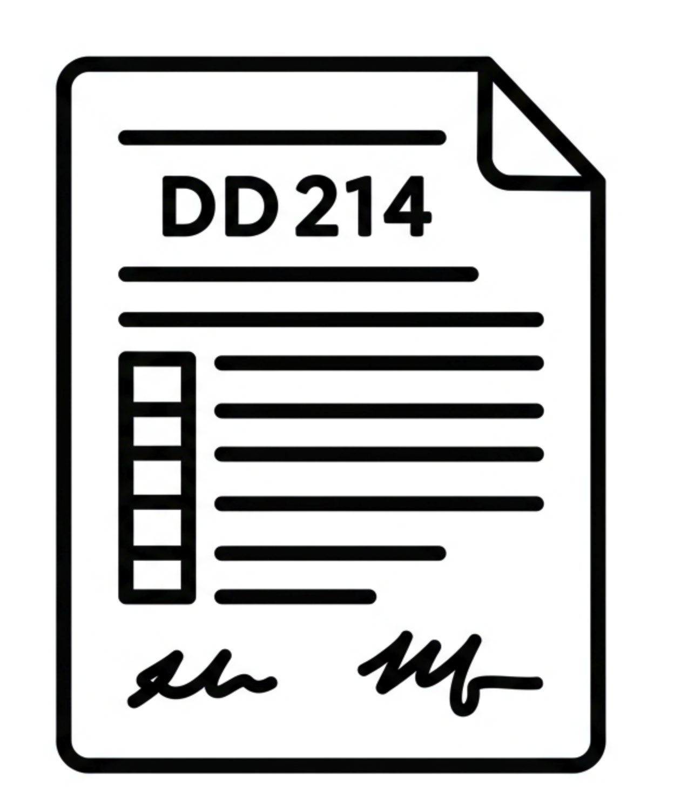

#  How-To: Decode Your DD Form 214 for Veteran's Preference

The Certificate of Release or Discharge from Active Duty (DD Form 214) is one of the most important documents for claiming veteran's preference. It contains the key information that federal agencies use to verify your eligibility. This guide will help you understand which boxes to look at.

*Disclaimer: This is a general guide. The format of the DD Form 214 has changed over the years. Always refer to your specific form.*

## Key Information Boxes

### Box 24: Character of Service
This is arguably the most critical box. To be eligible for any type of preference, your service must be under "honorable conditions."
*   **What to look for:** `HONORABLE` or `GENERAL (UNDER HONORABLE CONDITIONS)`.
*   **Why it matters:** A discharge characterized as `Other Than Honorable`, `Bad Conduct`, or `Dishonorable` generally disqualifies you from veteran's preference.
*   **Advisor Link:** [Discharge Conditions](./advisor/ownservice_discharged_honorableconditions.md)

### Box 18: Decorations, Medals, Badges, Citations, and Campaign Ribbons Awarded or Authorized
This box is crucial for determining eligibility for 5-point preference (TP) and some 10-point preference (XP).
*   **What to look for:**
    *   **Purple Heart:** If listed, you are eligible for 10-point preference (XP).
    *   **Campaign Medals:** Look for medals like the `Armed Forces Expeditionary Medal`, `Southwest Asia Service Medal`, `Kosovo Campaign Medal`, etc. Receipt of a qualifying campaign medal is a basis for 5-point preference.
    *   **Note:** The `National Defense Service Medal` and `Global War on Terrorism Service Medal` are generally *not* qualifying for preference on their own.
*   **Why it matters:** Serving in a specific campaign is a primary path to 5-point preference, especially for service outside of defined war periods.
*   **Advisor Link:** [Campaign Medal Check](./advisor/ownservice_tp_campaignmedal.md)

### Box 12: Record of Service
This box details your periods of service, including entry and separation dates.
*   **What to look for:** The dates in `12a` (Date Entered Active Duty) and `12b` (Separation Date This Period).
*   **Why it matters:** These dates determine if you served during specific qualifying periods for 5-point preference, such as:
    *   World War II (Dec 7, 1941 - Apr 28, 1952)
    *   Gulf War (Aug 2, 1990 - Jan 2, 1992)
    *   Post-9/11 / OIF (Sep 11, 2001 - Aug 31, 2010) - requires >180 days service.
*   **Advisor Link:** [Service Period Check](./advisor/ownservice_nodisability_nossps_checkserviceperiod.md)

### Box 11: Primary Specialty
While not directly for preference, this section details your military job.
*   **What to look for:** Your MOS, AFSC, NEC, or Rate.
*   **Why it matters:** This is vital for the `Crediting Experience` part of your federal job application, where you translate military skills to civilian job requirements.

### Box 28: Narrative Reason for Separation
This code or narrative can be important for special eligibility types.
*   **What to look for:** Phrases like "Sole Survivorship" could indicate eligibility for 0-point Sole Survivor Preference (SSP). Codes related to disability or hardship separation can be exceptions to the 24-month minimum service rule.
*   **Why it matters:** The reason for your separation can unlock specific preference paths.
*   **Advisor Link:** [Sole Survivor Check](./advisor/ownservice_ssp_checkdd214_reason.md)

---
Having your DD Form 214 handy when using our [Preference Advisor](./advisor/start.md) will make the process much smoother and more accurate.
